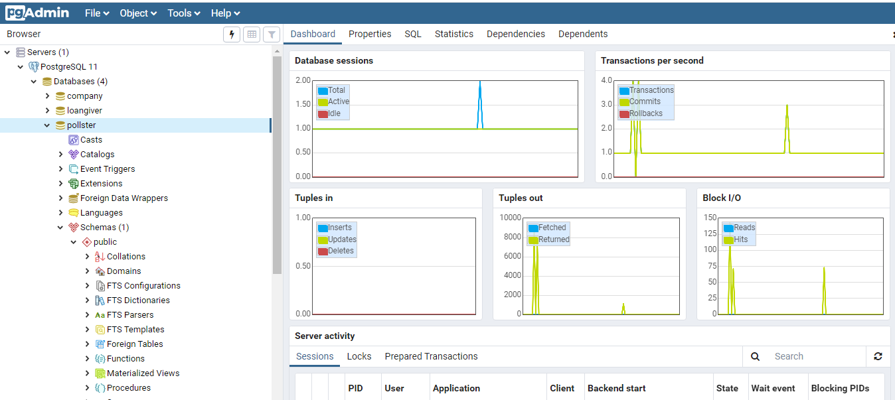
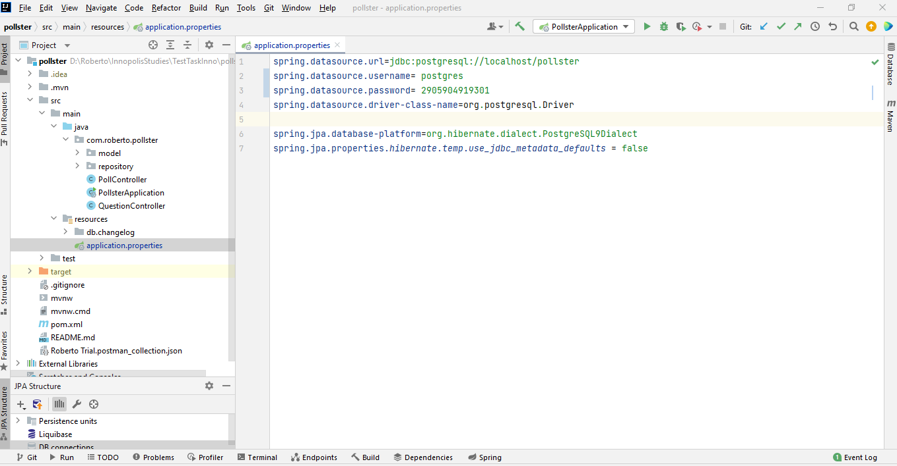
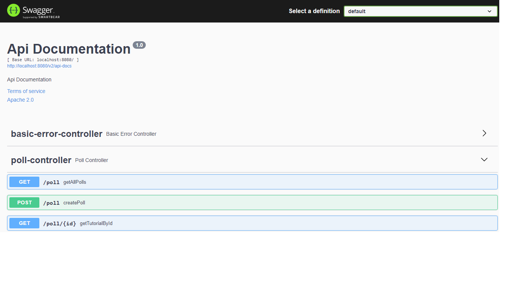

# REST - сервис для управления справочными данными

## Задание
Необходимо создать REST - сервис для управления справочными данными.
Структура данных:
Опрос
--------------------
Наименование опроса
Дата начала
Дата окончания
Активность (да/нет)

Вопрос опроса
--------------------
Ссылка на опрос
Текст вопроса
Порядок отображения

REST-сервис должен предоставлять следующие методы: - Получить все опросы (Опцио-нально можно передать фильтр по наименованию, дате, активности. Обязательно указание сортировки: по наименованию или по дате начала опроса. Должна поддерживаться пагина-ция.) - Создание опроса - Редактирование опроса - Удаление опроса
Сервис должен предоставлять документацию с использованием Swagger. Сервис при первом запуске должен самостоятельно создавать необходимые объекты в БД с помощью Liquibase. Необходимо использовать PostgreSQL.
Для реализации необходимо использовать Java 8, Spring Boot, Hibernate, PostgreSQL, Liquibase.

## Инструкции для запуска приложения.

1.- Клонируйте этот репозиторий.\ 
2.- Откройте проект с помощью IDE (предпочтительно IntelliJ IDEA)\
3.- IDE может предложить установить этот plug-in: [JPA Buddy](https://www.jpa-buddy.com/) Примите и установите.\
4.- Создайте локальную базу данных PostgreSQL с именем "pollster". Сделать это можно с помощью pgAdmin\
5.- Измените соответственно username и password в файле `application.properties`\
6.- Запустите приложение. Когда приложение запущено, вы можете открыть его в браузере по следующей ссылке: `localhost:8080/swagger-ui/`\

### pgAdmin:

### application.properties: 

### Browser view: 
